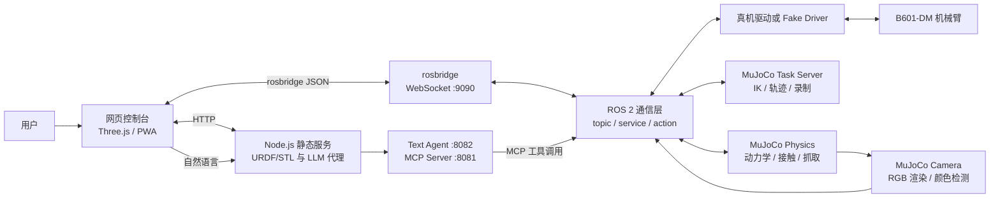
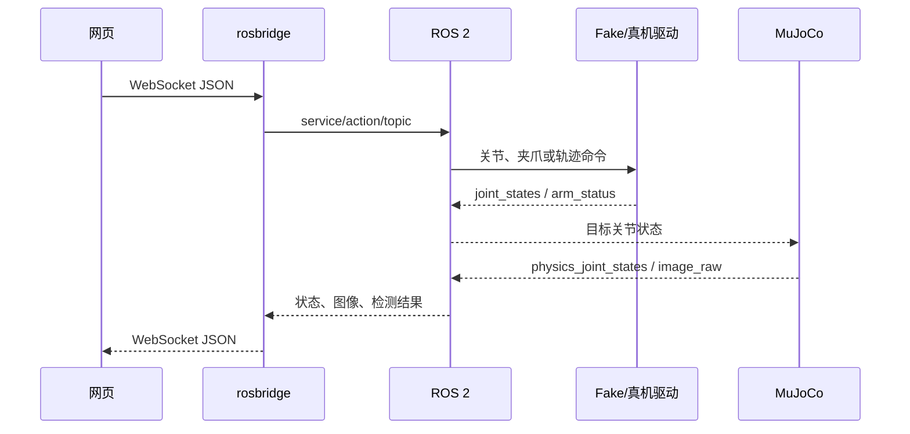

# reBot-DevArm 项目架构与功能说明

> 本文基于当前仓库代码整理，重点说明 ROS 2、MuJoCo 仿真和网页控制台之间的关系。文中的“网页模拟器”和“MuJoCo 仿真”是两套不同的运行系统，不能混为一谈。

## 1. 项目定位

本仓库是从 reBot-DevArm 软件链路整理出的 MuJoCo 专项项目，面向桌面具身智能和机器人开发教学，覆盖 ROS 2 接口、物理仿真、网页可视化、视觉检测和自然语言控制。机械加工源文件和 BOM 请从上游 reBot-DevArm 硬件仓库获取。

当前仓库主要围绕 reBot Arm B601-DM 展开，机械臂为 6 自由度本体加 1 个夹爪，软件主运行环境为 Ubuntu 24.04、ROS 2 Jazzy 和 Python 3.12。

## 2. 仓库目录

| 目录 | 作用 |
| --- | --- |
| `reBotArmController_ROS2-main/` | ROS 2 工作空间，包含真机驱动、假驱动、消息接口、MuJoCo 和 AI Agent |
| `reBotArm_simulator-DM/` | Node.js + Three.js 网页控制台，支持本地可视化、ROS 控制、相机预览和 LLM 对话 |

ROS 2 工作空间包含五个包：

| ROS 2 包 | 核心职责 |
| --- | --- |
| `rebotarm_msgs` | 自定义 msg、srv、action，如电机命令、夹爪服务和位姿动作 |
| `rebotarmcontroller` | 真机控制节点和假驱动，统一发布状态并接收运动命令 |
| `rebotarm_bringup` | launch、URDF、STL、RViz 和电机配置 |
| `rebotarm_mujoco` | real2sim、动力学闭环、物理抓取、IK、轨迹、虚拟相机和颜色检测 |
| `rebotarm_agent` | 将 ROS 能力封装为 MCP 工具，并提供文本 Agent/HTTP 接口 |

## 3. 总体架构



系统的关键设计是：网页、AI Agent、MuJoCo 和真机都不直接互相硬编码调用，而是尽量通过 ROS 2 的 topic、service 和 action 解耦。

## 4. ROS 2 控制层

### 4.1 真机模式

`reBotArmController` 创建唯一的底层 `RobotArm` 实例，负责：

- 连接电机总线并管理使能、失能和控制模式；
- 以默认 100 Hz 发布 `/rebotarm/joint_states`；
- 暴露安全回零、重力补偿、夹爪等服务；
- 接收单关节稀疏命令和标准 `FollowJointTrajectory`；
- 通过互斥/抢占策略避免多个上层同时控制机械臂。

真机重力补偿由 Pinocchio/SDK 计算广义重力，通过 MIT 模式叠加低增益位置保持和速度阻尼。该部分属于真机控制策略，不是 MuJoCo 物理仿真。

### 4.2 Fake Driver 模式

`FakeReBotArmDriver` 提供与真机近似一致的 ROS 接口，不连接电机。它维护目标位置和当前位置，按速度上限逐步逼近目标，并发布关节、夹爪和机械臂状态。

Fake Driver 是完整仿真栈中的“虚拟 ROS 执行器”。任务服务器向它发命令，MuJoCo 再订阅它发布的关节目标。因此它和 MuJoCo 的职责不同：

- Fake Driver 模拟控制接口和运动目标；
- MuJoCo 负责几何、动力学、碰撞、渲染或 real2sim 显示。

## 5. MuJoCo 仿真

### 5.1 是否使用官方 MuJoCo

是。代码直接导入 Python 包 `mujoco`，并使用 `mujoco.MjModel`、`mujoco.MjData`、`mujoco.mj_forward`、`mujoco.mj_step`、`mujoco.Renderer` 和 `mujoco.viewer` 等官方 Python API。仓库中没有自研物理引擎，也没有内置 MuJoCo 分叉版本。

但当前工程存在一个可复现性缺口：`setup.py` 只声明了 `setuptools`，`package.xml` 也没有声明 MuJoCo 运行依赖，同时仓库没有锁定 MuJoCo 版本。因此可以确认调用方式是官方 API，但不能仅凭仓库保证每台机器安装的是同一版本。建议补充 requirements/锁文件并记录已验证版本。

### 5.2 三种容易混淆的仿真模式

| 模式 | 是否调用 `mj_step` | 是否有真实动力学 | 主要用途 |
| --- | ---: | ---: | --- |
| 网页 Three.js 模拟器 | 否 | 否 | 浏览器交互、姿态展示、教学、ROS 控制面板 |
| MuJoCo real2sim | 否，只调用 `mj_forward` | 否 | 把 ROS/真机关节角同步到 MuJoCo 模型 |
| MuJoCo physics grasp / torque control | 是 | 是 | 重力、惯性、阻尼、碰撞、摩擦和抓取验证 |

#### real2sim

`real2sim_sync.py` 订阅 `/rebotarm/joint_states`，通过 YAML 完成 ROS 关节名、比例、偏置与 MuJoCo `qpos` 的映射，然后直接写入关节位置并调用 `mj_forward` 更新运动学。

它不会让关节受重力自然下落，也不会通过力矩把机械臂拉到目标位置。这里看到的“稳定”主要来自直接赋值，并不代表控制器动力学稳定。

real2sim 默认参数为：

- 同步频率 `sync_hz = 60 Hz`；
- `smoothing_alpha = 1.0`，即默认直接跟随，不做低通平滑；
- `stale_timeout = 1.0 s`，关节状态过期后停止继续应用旧数据；
- 可选虚拟抓取会把物体附着到末端，用于演示，不是接触力学抓取。

当真机编码器噪声导致画面抖动时，可将 `smoothing_alpha` 调到约 `0.15～0.4`。数值越小越平滑，但延迟越明显。

#### physics grasp

`mujoco_physics_grasp.py` 才是完整的接触动力学链路：

1. 订阅 Fake Driver 或其他来源的目标关节状态；
2. 在 500 Hz 控制回调中计算补偿力矩和 PD 力矩；
3. 将力矩写入 `qfrc_applied`；
4. 调用 `mujoco.mj_step` 推进一步动力学；
5. 发布仿真关节状态和自由物体位姿；
6. 相机节点读取这些状态，独立渲染 RGB 图像。

默认关节控制律可概括为：

```text
tau = qfrc_bias + Kp * (q_target - q) + Kd * (qd_target - qd)
tau = clip(tau, -tau_limit, +tau_limit)
```

其中 `qfrc_bias` 补偿模型的重力、科氏力等偏置项，`Kp` 提供位置恢复力，`Kd` 抑制速度和振荡，最后通过力矩限幅避免过大的瞬时作用力。

默认机械臂 `Kp` 从近端到末端逐步降低，`Kd` 同样分关节设置；夹爪使用更高的刚度和独立的力限制。这比所有关节使用同一组增益更符合串联机械臂不同惯量的特点。

#### torque control

`mujoco_torque_control.py` 提供纯 MuJoCo 的重力力矩对比和 `tau_g + PD` 闭环。它会将 MuJoCo 计算的重力力矩与底层 SDK 的重力模型比较，并发布差值，便于检查惯量、质心、坐标方向和关节映射是否一致。

### 5.3 为什么仿真不容易抖

当前代码通过多层措施降低抖动，而不是由某个单独参数“保证绝不抖”：

1. **小物理步长**：STL 物理模型使用 `timestep=0.001`，即 1 ms。
2. **提高求解精度**：接触模型设置 `iterations=100`、`noslip_iterations=20`。
3. **关节耗散**：默认关节设置 `damping=0.8`，直接消耗高频振荡能量。
4. **等效转子惯量**：`armature=0.01` 改善刚性控制下的数值条件。
5. **偏置力补偿**：控制器先抵消重力等偏置项，PD 不必长期用很大的位置误差托住机械臂。
6. **速度反馈阻尼**：`Kd * (qd_target - qd)` 抑制过冲和来回摆动。
7. **力矩限幅**：机械臂、夹爪均限制最大输出，避免瞬时冲击导致数值发散。
8. **软接触参数**：接触几何使用 `solref`、`solimp`，避免完全刚性的不可穿透约束。
9. **六维接触与防滑迭代**：`condim=6` 配合滑动、扭转和滚动摩擦，提高抓取稳定性。
10. **轨迹平滑**：任务服务器以 60 Hz 发命令，使用 `3t²-2t³` smoothstep 插值，并配置最大关节速度。
11. **状态互斥**：控制目标通过锁复制，viewer 更新也使用 MuJoCo viewer lock，避免读写竞争造成跳变。

### 5.4 “不抖”结论的边界

不能把当前实现理解成数学上或工程上已经保证任何模型、任何负载都不抖。仍需注意：

- real2sim 默认不滤波，输入噪声会直接显示出来；
- ROS 2 Python timer 不是硬实时控制周期，系统负载高时会有周期抖动；
- 物理模型每次 500 Hz 回调只执行一个 1 ms `mj_step`，名义仿真时间约为墙上时间的一半，尚未做基于 elapsed time 的多步追赶；
- 夹爪和物体摩擦系数较高，能提升演示抓取成功率，但未必等同真实材料参数；
- STL 主要用于视觉，碰撞体是简化 box，这有利于稳定和性能，但会牺牲接触几何精度；
- 当前没有自动化的静止抖动、能量漂移、接触穿透和实时率回归测试；
- MuJoCo 版本未锁定，不同版本的求解结果可能存在细微差异。

因此，更准确的说法是：当前参数和控制策略对演示场景进行了稳定性优化，但稳定性仍依赖模型质量、控制增益、输入轨迹、负载、接触参数和运行时调度。

### 5.5 MuJoCo 模型组成

主要模型文件如下：

| 文件 | 特点 |
| --- | --- |
| `rebotarm_b601_stl.xml` | 完整质量/惯量、STL 外观、简化碰撞体、物理抓取参数，主模型 |
| `rebotarm_b601_kinematic.xml` | 使用基础几何体表达机械臂，适合轻量运动学用途 |
| `simple_rebotarm.xml` | 更简化的通用串联机械臂模型，几何与真实 B601 有差异 |

`joint_map_kinematic.yaml` 将一个 ROS 夹爪关节映射为左右两个 MuJoCo 滑动关节，其中右指使用反向比例，实现对称开合。

### 5.6 任务、相机和视觉

`sim_task_server.py` 使用 MuJoCo Jacobian 求解 IK，支持：

- `MoveToPoseIK` 可达性检查；
- `MoveToPose` 动作；
- 标准 `FollowJointTrajectory`；
- 轨迹录制、保存和回放；
- 目标位姿可视化；
- 最大关节速度和关节限位约束。

`sim_rgb_camera.py` 使用官方 `mujoco.Renderer` 从模型中的固定相机渲染图像，发布 `/rebotarm/mujoco/overhead_rgb/image_raw`。`sim_color_detector.py` 再从 RGB 图像检测彩色物块并发布检测结果，网页可据此发起视觉抓取演示。

## 6. 网页控制台

### 6.1 网页端定位

`reBotArm_simulator-DM` 是一个无前端构建步骤的轻量网页应用：

- Node.js 原生 `http/https` 模块提供静态文件和少量代理 API；
- Three.js r128、STLLoader 和 URDFLoader 直接放在 `public/lib/`；
- 前端由原生 HTML、CSS、JavaScript 组成；
- 支持 Service Worker 和 Web App Manifest，可作为 PWA 安装；
- `package.json` 没有声明第三方 npm 运行依赖。

它本身不是 MuJoCo 前端，也没有在浏览器中运行 MuJoCo。网页加载 ROS 2 的 URDF/STL 后，由 Three.js 直接设置关节旋转并渲染。

### 6.2 网页模块

| 文件 | 职责 |
| --- | --- |
| `server.js` | 静态服务、HTTPS、URDF/STL API、LLM HTTP 代理 |
| `public/js/rebot-sim.js` | Three.js 场景、机械臂、夹爪、预设姿态、轨迹动画、TCP 拖拽和示教 |
| `public/js/ros/rebot-ros-client.js` | 直接实现 rosbridge JSON 协议、topic、service 和 action 调用 |
| `public/js/ros/rebot-ros-ui.js` | ROS 面板、诊断、安全开关、相机、视觉抓取和状态镜像 |
| `public/js/rebot-llm.js` | 文本对话 UI，调用 Node.js 的 LLM 代理接口 |
| `public/js/pwa.js` | Service Worker 注册和 PWA 安装提示 |

### 6.3 模型加载

Node.js 从 ROS 2 bringup 包读取：

```text
rebotarm_bringup/description/urdf/reBot-DevArm_fixend.urdf
rebotarm_bringup/description/meshes/*.STL
```

并通过 `/api/urdf`、`/api/description/meshes/...` 提供给浏览器。网页另外加载拆分后的夹爪 STL，在 `end_link` 上补充可视夹爪。

这样做保证网页和 ROS 2 共用同一份机械臂外形资源，但网页中夹爪视觉、工作空间包络和虚拟抓取仍包含前端自定义逻辑。

#### 当前仓库与 standalone 包为什么目录不同

当前仓库采用 **monorepo（网页与 ROS 2 放在同一仓库）** 布局。`server.js` 通过相对路径读取相邻 ROS 2 包中的唯一一份主体模型：

```text
reBot-DevArm-main/
├─ reBotArmController_ROS2-main/
│  └─ src/rebotarm_bringup/description/
│     ├─ urdf/                     主模型 URDF
│     └─ meshes/                   机械臂与当前夹爪 STL
└─ reBotArm_simulator-DM/
   ├─ public/                      网页代码
   └─ split_meshes/grouped_gripper/ 网页夹爪补充网格
```

因此，当前仓库的网页目录不需要再保存一套 `meshes/` 和 `urdf/`。这样可以避免同一模型出现两份副本、修改一份却忘记同步另一份。网页目录不能脱离仓库单独复制运行，因为它依赖兄弟目录 `reBotArmController_ROS2-main`。

下载目录中曾出现的 standalone 布局，是为了把网页文件夹单独分发：

```text
reBotArm_simulator-DM/
├─ urdf/
├─ meshes/
├─ split_meshes/grouped_gripper/
├─ public/
└─ server.js
```

standalone 版本必须同时复制匹配版本的 URDF、主体 `meshes/` 和 `grouped_gripper/`，并让 `server.js` 改为读取本目录资源。只复制 URDF、不复制 meshes 会导致模型网格加载失败；混用不同版本则可能造成夹爪缺失、重复或关节结构不一致。

`split_meshes/end_link/` 是将原始末端 STL 拆分时产生的几十个中间零件及清单，用于重新加工模型，不是网页运行依赖。当前运行只使用整理后的四个文件：`gripper_base.stl`、`gripper_hardware.stl`、`left_finger.stl` 和 `right_finger.stl`，所以仓库只保留 `split_meshes/grouped_gripper/`。如果以后需要重新切分或调整夹爪几何，应在独立的资产加工分支或外部归档中保存 `end_link/` 中间产物，不要混入运行目录。

### 6.4 本地交互功能

即使没有 ROS，网页也可以完成：

- 六关节和夹爪滑块控制；
- home、ready、pick、place 等姿态预设；
- 平滑动画和取放路径演示；
- TCP 位置显示、拖拽和目标 ghost；
- 工作空间包络估计；
- 示教点录制、回放和 ROS waypoint 导出；
- 虚拟物体搬运。

这些功能属于浏览器运动学/动画。物体被抓起通常是前端附着逻辑，不应作为真实接触仿真的验证结果。

### 6.5 ROS 连接链路

网页不依赖 roslibjs，而是在 `ReBotRosClient` 中直接使用浏览器 `WebSocket` 实现 rosbridge JSON 消息。默认连接地址为：

```text
ws://<主机实际 IP>:9090
```

主要链路为：



网页支持：

- 使能、失能、安全回零和重力补偿；
- 关节低层命令、夹爪服务；
- IK 检查、位姿动作和关节轨迹；
- joint state 镜像和误差显示；
- ROS topic/service 诊断；
- MuJoCo 相机预览和颜色检测；
- 仿真轨迹记录与回放。

网页默认将“允许网页向真实机械臂发控制”关闭，这是重要的防误操作门槛。使用真机时还应保留现场急停、限位、低速测试和操作空间隔离，不能只依赖网页复选框。

### 6.6 LLM/MCP 链路

自然语言控制不由浏览器直接调用 ROS：

```text
网页 rebot-llm.js
  -> Node.js /api/llm/chat
  -> Text Agent HTTP 服务（默认 :8082）
  -> MCP Server（默认 :8081/mcp）
  -> ROS 2 service/action/topic
```

`rebotarm_agent` 将诊断、使能、夹爪、关节、位姿、轨迹、视觉和记录等能力封装为 MCP 工具。该分层使 LLM 负责理解意图，MCP 层负责将意图约束为结构化机器人操作。

### 6.7 HTTP、HTTPS 和 PWA

开发默认端口为 `3001`。局域网手机通过普通 HTTP 可以访问，但浏览器通常不会把非 localhost 的 HTTP 视为安全上下文，因此无法完整安装 PWA。

HTTPS 模式默认使用 `3443`，并要求本地证书。HTTPS 页面连接 rosbridge 时必须使用 `wss://`，否则会被浏览器的 mixed content 策略阻止。

## 7. 典型运行链路

### 7.1 完整物理仿真

在 ROS 2 工作空间构建并 source 环境后：

```bash
./scripts/start_rebot_mujoco_all.sh
```

默认启动：

1. Fake Driver 和 robot_state_publisher；
2. MuJoCo physics grasp；
3. MuJoCo task server；
4. MuJoCo overhead RGB camera；
5. color detector；
6. rosbridge WebSocket。

随后在网页目录运行：

```bash
npm start
```

浏览器打开 `http://localhost:3001`，再连接 ROS WebSocket。

### 7.2 纯 real2sim

将抓取模式切换为非 physics 后，启动脚本会运行 `real2sim_sync`。该模式适合查看真机或 Fake Driver 姿态，不适合评估接触力、抓取力或动力学稳定性。

### 7.3 真机 + 网页

真机模式应启动真实 bringup/driver 和 rosbridge，网页通过相同 ROS 接口控制。建议先用 Fake Driver 验证接口、关节方向和限位，再低速切换真机。

## 8. 当前架构的优点

- 硬件、控制、仿真、网页和 AI 均有源代码，可独立学习和替换；
- ROS 2 接口统一，Fake Driver、真机和 MuJoCo 可以组合使用；
- MuJoCo 同时覆盖运动学同步、动力学闭环、接触抓取和离屏渲染；
- 网页无需复杂前端构建，部署和调试成本低；
- 网页既可离线演示，也能通过 rosbridge 操作完整 ROS 能力；
- LLM 经 MCP 转成结构化工具调用，没有把自然语言直接映射为电机字节流。

## 9. 建议优先改进项

1. **锁定仿真依赖**：明确 Python `mujoco`、NumPy 等版本，并补充自动安装说明。
2. **统一仿真时钟**：按实际 elapsed time 每周期执行 1～N 个 `mj_step`，发布 real-time factor。
3. **增加稳定性测试**：记录静止关节 RMS 抖动、能量漂移、接触穿透、抓取保持时间和控制周期 jitter。
4. **标定物理参数**：用真机实验校准质量、质心、惯量、关节摩擦、夹爪摩擦和电机力矩上限。
5. **给 real2sim 增加可配置滤波**：除了固定 alpha，可按采样周期使用截止频率定义的一阶低通，并显示滤波延迟。
6. **强化真机安全边界**：后端强制关节/速度/力矩限幅、命令超时和急停状态，不把安全只放在浏览器 UI。
7. **减少模型和常量重复**：夹爪行程、关节限位、坐标映射目前分散在 URDF、MJCF、YAML 和 JavaScript 中，建议生成或集中配置。
8. **补充端到端测试**：覆盖网页 -> rosbridge -> Fake Driver -> MuJoCo -> camera -> 网页的完整回归链路。

## 10. 一句话总结

该项目以 ROS 2 为中枢：真机驱动和 Fake Driver 提供统一控制接口，官方 MuJoCo Python API 承担运动学、动力学、接触和渲染，Node.js + Three.js 网页承担轻量可视化与操作，LLM/MCP 则在 ROS 2 之上增加自然语言入口。当前仿真通过小步长、阻尼、偏置力补偿、PD、限幅、软接触和轨迹平滑来降低抖动，但还需要版本锁定、实时率处理、物理标定和自动化稳定性测试，才能把“演示稳定”提升为“可量化、可复现的稳定”。
